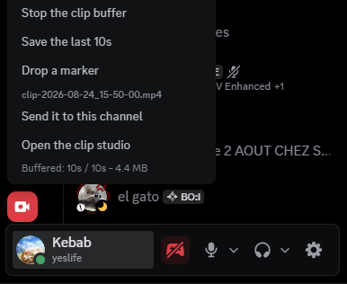
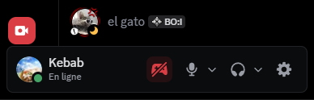
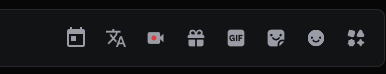
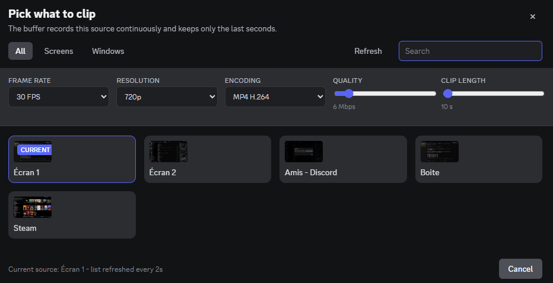
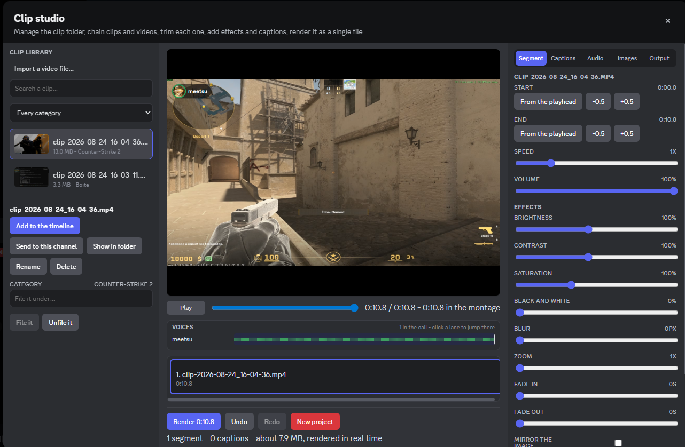
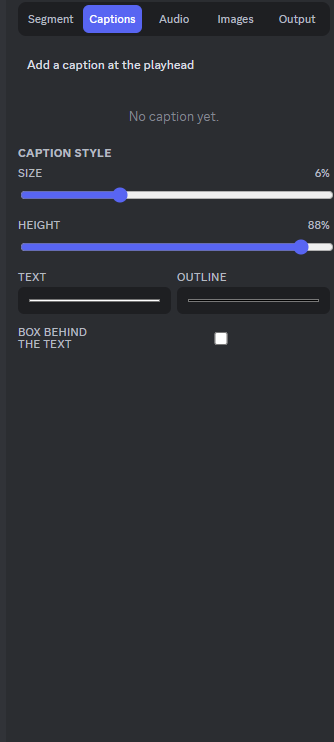
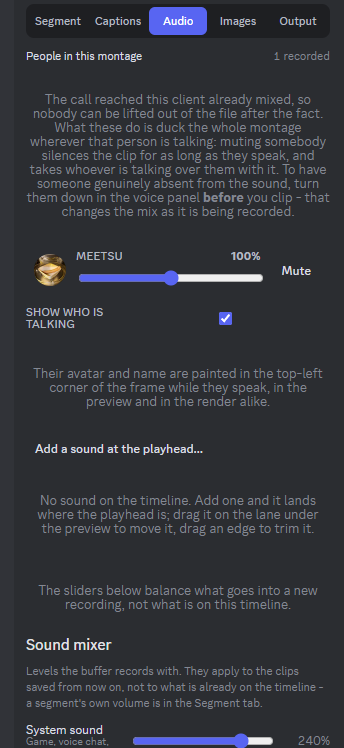
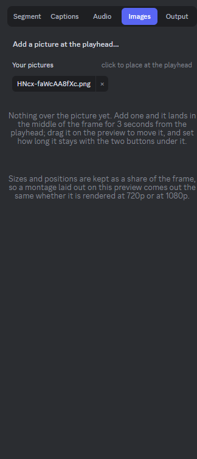
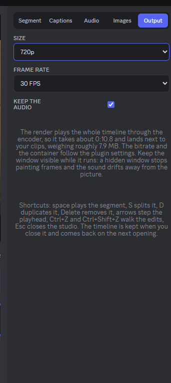

# Clipper — Vencord user plugin

Free Clipping plugin for vencord because fuck giving money to corporations

<p align="center">
  
</p>

## Features

- Rolling in-memory buffer, configurable from 10s to 300s
- Save keybind and start/stop keybind, both rebindable from the settings panel,
  registered system-wide so they fire from inside a game
- Quality controls: video bitrate (1–50 Mbps), audio bitrate (64–320 kbps),
  resolution (source / 2160p → 480p), frame rate (24 / 30 / 60 / 120)
- Container / codec choice: WebM VP9, WebM VP8, MP4 H.264
- Optional microphone mixed into the clip audio, using the input device, volume,
  echo cancellation, noise suppression and gain control already set in Discord's
  voice settings
- Settings grouped into sections — **Capture**, **Audio**, **Clips**,
  **Interface**, **Keybinds** — so every sound source sits under *Audio*
- Sound mixer in the **Audio** section: one slider (0–300%) and one mute per
  audio channel, with a live meter while the buffer runs. **System sound** is the
  captured source, **Microphone** is your own voice, and any input device can be
  added as its own channel. Moving a slider is heard in the clip being buffered
  right now, not only in the next one
- Built-in source picker with live previews, searchable, screens and windows
- Clip studio, one window for the whole clip folder and a light video editor.
  The left panel is the library: search, category filter, and for the picked
  clip *Add to the timeline*, *Show in folder*, *Rename*, *Delete* (to the
  trash) and *File it* under a category. Double-clicking a clip drops it
  straight on the timeline.
- On that timeline: chain several clips and imported MP4 / WebM / MOV / MKV
  files, trim, split, duplicate and reorder each segment, cut a range out of the
  montage from the ruler above it (drag to mark, *Cut out* to remove it, *Keep
  only* to throw away the rest; captions, overlays and sounds move with the
  picture), give it its own speed
  (0.25x–4x) and volume, add effects (brightness, contrast, saturation, black
  and white, blur, zoom, mirror, fade in / out), save the frame under the
  playhead as a PNG, lay captions over the result with their own size, colour,
  outline and position, then render the whole thing to a single file
  (480p–1440p, 24/30/60 FPS, audio optional). The timeline survives closing the
  studio and every edit can be undone with `Ctrl + Z`.
- Clip categories: each clip is filed under the game Discord saw running when
  it was saved (the captured window's title as a fallback), stored in a
  `clipper-library.json` next to the clips. The studio filters the list by
  category and any clip can be refiled by hand.
- Studio shortcuts: `Space` plays the selected segment, `S` splits it, `I` and
  `O` mark a range on the ruler, `X` cuts that range out, `Shift + X` keeps only
  it, `D` duplicates the segment, `Delete` removes it, `←` / `→` step the
  playhead, `Ctrl + Z` and `Ctrl + Shift + Z` walk the edits, `Esc` closes
- Chat bar button — left click saves, right click starts/stops
- Floating button above the account panel — left click opens the source picker,
  right click opens the actions menu (start/stop, save, clip studio, buffer
  status)
- Vencord toolbox entries for the same actions
- Clips written straight to disk on the desktop app (configurable folder,
  defaults to `<Videos>/DiscordClips`), browser download as fallback

## What it looks like

The button sits above the account panel — left click opens the source picker,
right click opens the actions menu.

<p align="center">
  
</p>

A second one lives in the chat bar, next to the gift and GIF buttons — left
click saves, right click starts or stops the buffer.

<p align="center">
  
</p>

The picker lists screens and windows with a live preview, and carries the
capture settings that are worth changing often: frame rate, resolution,
encoding, quality and buffer length.



The clip studio is the clip folder and the editor in one window: library on the
left, preview and timeline in the middle, the picked segment's trim, speed,
volume and effects on the right.



The right panel's other tabs cover the rest of a montage — captions, the sound
of the people in the call plus the mixer, images laid over the frame, and the
render settings.

| Captions | Audio |
| --- | --- |
|  |  |
| **Images** | **Output** |
|  |  |

## Install

Windows, no toolchain: close Discord (and Vesktop), then run

```
install.bat
```

Nothing else is needed — no node, no pnpm, no Vencord clone. `prebuilt/dist` is
a finished Vencord build with Clipper compiled into it; the installer copies it
to `%APPDATA%\Vencord\clipper\dist`, patches Discord to load it (the real
`app.asar` is kept as `_app.asar`, which is exactly what the Vencord installer
does), and points Vesktop / Equibop at the same folder.

Start Discord, then enable **Clipper** in Vencord → Plugins.

Undo with `install.bat --uninstall`: Discord is unpatched, Vesktop's *Vencord
Location* is cleared, the copied bundle is deleted. Vencord settings and themes
in `%APPDATA%\Vencord` are left alone.

> The bundle **replaces** whatever Vencord install Discord was using, a dev one
> included. If you already run Vencord from a checkout, use the source install
> below instead, so your own build keeps its other plugins.

`prebuilt/build-info.json` records the Vencord version and commit the bundle was
built from. Vencord is GPL-3.0, sources at
<https://github.com/Vendicated/Vencord>.

### Source install

For a [Vencord dev install](https://docs.vencord.dev/installing/), or any
platform other than Windows:

```sh
git clone https://github.com/Vendicated/Vencord
cd Vencord
pnpm install --frozen-lockfile
mkdir -p src/userplugins
cp -r "<this repo>/src/userplugins/Clipper" src/userplugins/Clipper
pnpm build
pnpm inject   # only the first time
```

PowerShell equivalent for the copy step:

```powershell
Copy-Item -Recurse "<this repo>\src\userplugins\Clipper" "<Vencord>\src\userplugins\Clipper"
```

Restart Discord, then enable **Clipper** in Vencord → Plugins.

On Windows, `install.bat --source [path\to\Vencord]` does the copy, the build
and the Vesktop wiring for you, finding the checkout Discord is already patched
with when no path is given.

To refresh the shipped bundle after changing the plugin, run
`scripts\build-prebuilt.ps1 [-VencordDir <path>]`.

### Vesktop

Vesktop ships its own Vencord, so it has to be pointed at the build that
contains the plugin. Both installer modes do that for you — the prebuilt one at
the installed bundle, `--source` at the `dist` folder of the repo it just built.
It is written as `vencordDir` in Vesktop's `state.json`, under
`%APPDATA%\vesktop`. **Close Vesktop first** — it rewrites that file when it
exits, which would undo the change — then run the installer and start Vesktop
again.

By hand, or on Linux: build Vencord as above (no `pnpm inject`), then in
Vesktop **Settings → Vencord Location → the `dist` folder of your Vencord
clone**, and restart Vesktop. Enable **Clipper** in Vencord → Plugins as usual.

What differs there:

- Vesktop owns Electron's display-media handler for its own picker and its Linux
  audio capture, and Electron keeps only one. The plugin never takes it over, so
  capture goes through the legacy desktop constraints instead, and Vesktop's own
  picker is used as a last resort. Nothing about Vesktop's screen share changes.
- **Wayland** has no window list: `desktopCapturer` goes through
  xdg-desktop-portal, which pops a system dialog on every call. The plugin's own
  picker is empty there and says so — start the buffer and pick the source in
  the portal dialog. X11 lists screens and windows normally.
- **No per-application audio.** Chromium hands out the captured source's sound
  as one already-mixed loopback stream, so the game, the people talking and the
  music cannot be told apart by the plugin. To give one app its own slider, send
  it to a virtual cable (VB-CABLE, Voicemeeter) and add that cable as a channel
  in the sound mixer.
- **System audio is Windows-only** on this capture path. On Linux the clip has
  the microphone (enable **Include mic**) but no desktop audio.
- **Wayland ignores application-registered hotkeys**, so the keybinds only fire
  while Discord is focused. Bind a compositor shortcut, or use the chat bar
  button.

## Usage

| Action | Default |
| --- | --- |
| Start / stop the buffer | `Alt + F9`, panel button menu, chat bar button right click, or toolbox |
| Save the last N seconds | `Alt + F10`, panel or chat bar button left click, or toolbox |
| Trim, cut or montage clips | Panel button right click → *Open the clip studio*, or toolbox |
| Manage the clip folder | Same window: pick a clip on the left, then rename / reveal / delete / file it |
| Sort clips by game | Category dropdown above the clip list; *File it* refiles the picked clip |
| Find a clip | Search box above the clip list |
| Balance the clip audio | Plugin settings → *Audio* → *Sound mixer*, or the studio's *Audio* tab, live while recording |
| Add an audio source | Same section, *Add an audio source*, then pick the input device |
| Undo a montage edit | `Ctrl + Z`, `Ctrl + Shift + Z` to redo |
| Trim the selected segment | *From the playhead* under Start / End, or `←` / `→` then the same button |

Pick what to record from the plugin's own picker (overlay button, chat bar
button, or toolbox): the game window, or the whole screen if you alt-tab a lot.
System audio is captured for whole screens; enable **Include mic** to mix your
microphone in.

Avoid binding `Ctrl+R` or `Ctrl+Shift+R`: Chromium reloads the client on those
before any DOM listener runs, so the plugin never sees them.

Keybinds are registered with the OS through Electron's `globalShortcut`, so they
fire while a game is focused, not only inside Discord. Turn **Global keybinds**
off in the settings to keep them Discord-only. A bind another application
already owns cannot be taken — the plugin says so with a toast and falls back to
firing it only while Discord is focused.

## Files

| File | Role |
| --- | --- |
| `index.tsx` | Plugin definition, in-client keybind listener, toolbox actions |
| `settings.tsx` | All settings + mime type resolution |
| `recorder.ts` | Capture, rolling buffer, saving |
| `clips.ts` | Clip folder access: listing, loading, renaming, deleting, frame export |
| `mixer.ts` | Audio channel levels and the input device list behind the sound mixer |
| `library.ts` | Clip categories: game detection and the `clipper-library.json` sidecar |
| `studio.ts` | Timeline model and the montage render engine (canvas + WebAudio) |
| `webm.ts` | Rebases the buffered WebM timeline so saved clips start at zero |
| `globalKeybinds.ts` | System-wide keybind registration and dispatch |
| `native.ts` | Main process: file write, source listing, global shortcuts |
| `utils.ts` | Keybind parsing / accelerators, formatting helpers |
| `components/ClipperOverlay.tsx` | Floating button, source picker, capture options |
| `components/ClipStudio.tsx` | Clip library, categories, timeline, effects, captions, render |
| `components/AudioMixer.tsx` | Sound mixer rows, in the settings and in the studio sidebar |
| `components/SettingsSection.tsx` | Section headers that group the settings panel |
| `components/ClipperChatButton.tsx` | Chat bar button |
| `components/KeybindInput.tsx` | Keybind picker used by the settings |
| `components/SaveDirectoryInput.tsx` | Clip folder picker used by the settings |

## Known limitations

- **WebM timeline.** Clips are assembled from the container header plus the
  buffered clusters, and those clusters carry timecodes counted from the moment
  capture started — a buffer running for seven minutes used to write a 15s clip
  claiming to last seven, mostly empty, and often undecodable. `webm.ts` now
  rewrites the kept clusters so the clip starts at zero, drops anything older
  than a 3s gap (a starved or paused capture) and trims the head back to a
  keyframe, so the file opens on a decodable frame. The header still carries no
  duration field, so a few editors want a remux first:
  `ffmpeg -i clip.webm -c copy fixed.webm`. Rendering from the studio also
  produces a clean file, since that path re-encodes. MP4 recordings are left
  untouched: their fragments need a different parser.
- **The studio renders in real time**, because there is no muxer in the plugin:
  the timeline is played into one canvas and one audio mix, and a single MediaRecorder
  records the run, so a 2-minute montage takes 2 minutes. Segments are cut, not
  crossfaded — a fade out into a fade in is the transition on offer. Sources of
  different shapes are letterboxed into the 16:9 output rather than stretched.
  Keep the window visible while it renders: a hidden window stops painting
  frames while the audio keeps running, and the two drift apart.
- **Imports are capped at 512 MB.** An imported file is read in the main
  process, copied across IPC and held in memory while the timeline is open, so
  a bigger one is refused rather than allowed to take the client down with it.
  MKV and some MOV files are also outside what Chromium decodes; remux them to
  MP4 first.
- **Game detection is Discord's.** Categories come from `RunningGameStore`, the
  same detection that drives the activity status, so a game Discord does not
  recognise (a browser game, an emulator) falls back to the captured window's
  title and may need refiling by hand. The categories live in
  `clipper-library.json` next to the clips: deleting that file loses the
  categories, not the clips.
- **Mic processing is Chromium's.** The plugin reads Discord's voice settings and
  asks `getUserMedia` for the same device, volume, echo cancellation, noise
  suppression and gain control, so the clip matches what Discord sends. Krisp is
  a separate native module Discord applies to its own voice connection only; it
  is not part of the capture, so heavy background noise may survive into the clip
  even when Krisp is on in Discord.
- **Memory use** scales with `clip length × video bitrate`. 300s at 50 Mbps is
  roughly 1.8 GB held in RAM — the defaults (30s at 8 Mbps) sit around 30 MB.
- **MP4 recording** depends on the Chromium build shipped with your Discord
  version. If MP4 is unsupported, starting the buffer fails; switch back to WebM.
- **Global keybinds are first come, first served.** If Steam, GeForce Experience
  or another overlay already registered the accelerator, Windows hands it to
  them and the bind only works while Discord is focused. Rebind to something
  free. Keys with no Electron accelerator name stay Discord-only as well.
- **Linux system audio.** Loopback capture through `getDisplayMedia` exists only
  on Windows, so clips recorded on Linux carry no desktop audio.
- Encoding is software-side (Chromium's MediaRecorder), so a high bitrate at
  120 FPS costs noticeably more CPU than a native GPU encoder would.
